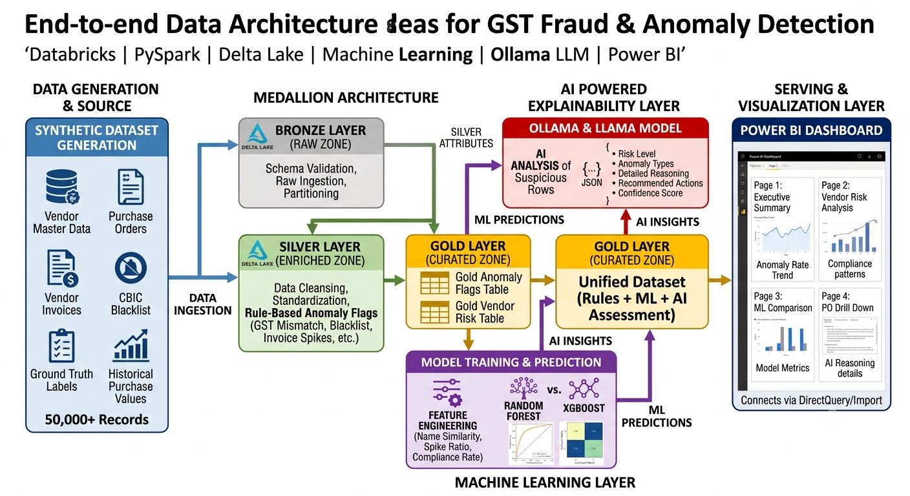
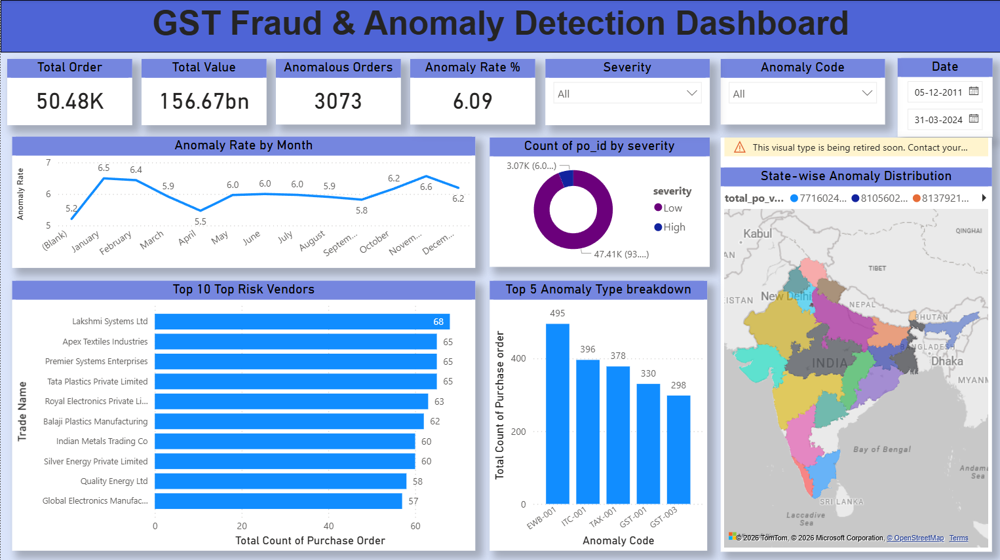
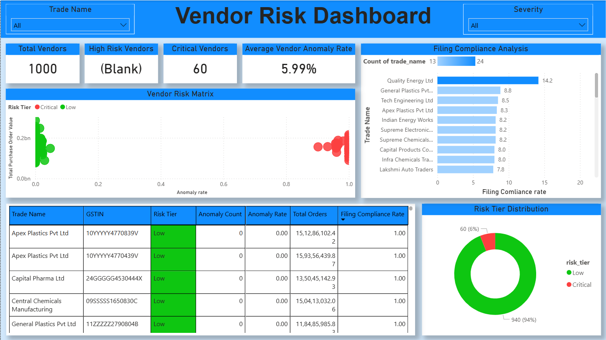
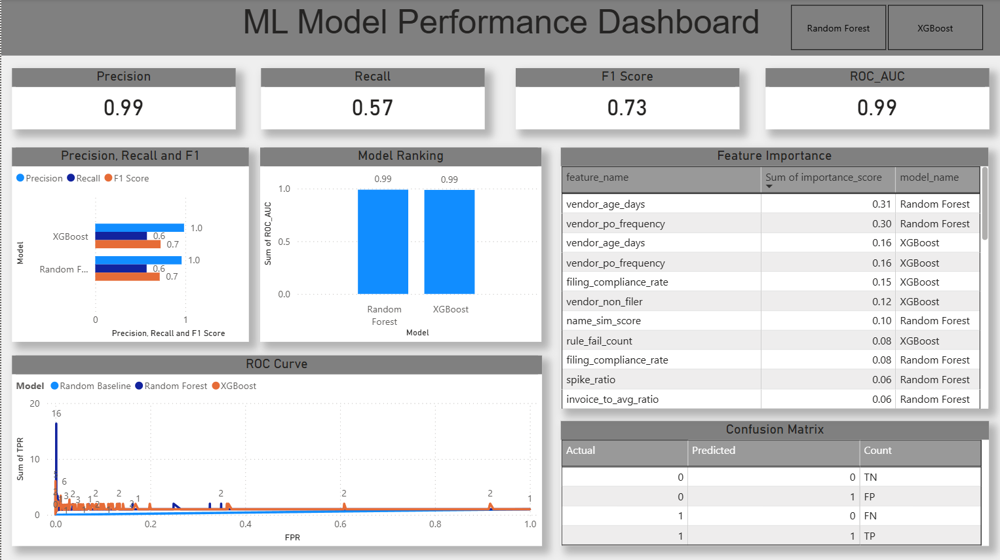
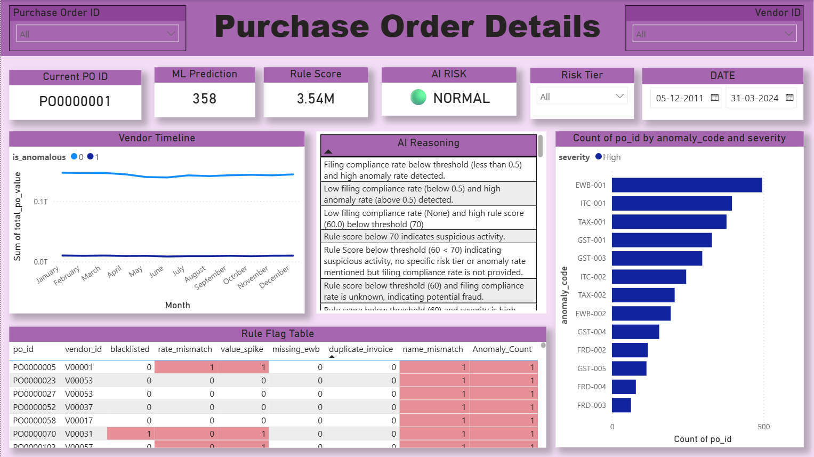

# GST Fraud & Anomaly Detection Using Data Engineering, Machine Learning & AI

## Project Description

This project implements an end-to-end GST Fraud & Anomaly Detection System using a modern Lakehouse Architecture (Bronze, Silver, Gold), Machine Learning models, and AI-powered reasoning.

The system processes large-scale GST Purchase Order (PO) data, identifies suspicious transactions using rule-based checks, predicts anomalies using Machine Learning models, and provides human-readable risk explanations using Large Language Models (LLMs).

The complete solution was built using **PySpark, Databricks, XGBoost, Ollama (Llama 3.1), and Power BI**.

---

## Problem Statement

GST fraud and compliance violations result in significant financial losses due to:

- Fake Vendors
- GSTIN Mismatches
- Incorrect Tax Calculations
- Input Tax Credit (ITC) Fraud
- Missing E-Way Bills
- Blacklisted Vendors
- Invoice Manipulation

Traditional rule-based systems can detect known fraud patterns but often fail to identify hidden or evolving fraud techniques.

This project aims to build a scalable anomaly detection platform that combines Data Engineering, Machine Learning, and AI reasoning to improve fraud detection accuracy.

---

## Objectives

- Generate a realistic GST dataset with injected anomalies
- Build a Bronze-Silver-Gold Lakehouse Architecture
- Implement GST compliance and fraud detection rules
- Perform feature engineering for anomaly detection
- Train and compare Machine Learning models
- Generate AI-based risk explanations using LLMs
- Create an interactive Power BI dashboard for business users

---

## Technologies Used

### Data Engineering

- PySpark
- Databricks Community Edition
- Delta Lake
- Parquet

### Machine Learning

- Scikit-Learn
- Random Forest Classifier
- XGBoost Classifier

### AI

- Ollama
- Llama 3.1

### Visualization

- Power BI

### Programming Language

- Python

---

## Dataset

Synthetic GST Dataset generated using Python and Faker.

### Dataset Size

| Dataset | Records |
|----------|----------|
| Vendors | 1,000 |
| Purchase Orders | 50,000 |
| Vendor Invoices | 50,000 |
| Historical PO Values | 12,000 |
| Ground Truth Labels | 50,000 |
| HSN Master | 20 |
| CBIC Blacklist | 20 |

### Injected Anomalies

- Blacklisted Vendors
- GST Rate Mismatch
- Name Mismatch
- Missing E-Way Bill
- Duplicate Invoices
- High Value Transactions
- Filing Compliance Violations
- Value Spike Detection

---

#Architecture Diagram

## Architecture Diagram




---

# Lakehouse Architecture

## Bronze Layer

Raw data ingestion layer.

### Features

- Schema Validation
- Raw Data Storage
- Parquet Conversion
- Partitioning
- Metadata Tracking

### Output Tables

- bronze_purchase_orders
- bronze_vendors
- bronze_invoices
- bronze_historical
- bronze_hsn
- bronze_blacklist

---

## Silver Layer

Data cleansing and enrichment layer.

### Implemented Features

- GSTIN Validation
- State Code Validation
- Name Similarity Matching
- HSN Rate Verification
- Filing Compliance Calculation
- Vendor Risk Indicators
- Rule Engine Processing

### Feature Engineering

- name_sim_score
- filing_compliance_rate
- vendor_age_days
- spike_ratio
- invoice_to_avg_ratio
- high_value_invoice_flag
- director_overlap_flag
- vendor_po_frequency
- invoice_count_same_vendor_same_day

---

## Gold Layer

Business-ready analytical layer.

### gold_anomaly_flags

Contains:

- Rule Flags
- Feature Engineering Outputs
- Ground Truth Labels
- Composite Risk Scores

### gold_vendor_risk

Contains:

- Total PO Value
- Total PO Count
- Anomaly Count
- Anomaly Rate
- Filing Compliance Rate
- Vendor Risk Tier

---

## Rule-Based Detection Engine

Implemented anomaly detection rules:

- Blacklisted Vendor Detection
- GST Rate Mismatch Detection
- Name Similarity Validation
- Missing E-Way Bill Detection
- Duplicate Invoice Detection
- Filing Compliance Validation
- High Value Invoice Detection
- Value Spike Detection

### Generated Outputs

- rule_score
- anomaly_count
- severity
- predicted_anomaly

---

## Machine Learning Models

### Model 1: Random Forest

Used as baseline classification model.

### Model 2: XGBoost

Selected as the final model due to superior performance.

### XGBoost Performance

| Metric | Score |
|----------|----------|
| Accuracy | 71.5% |
| Precision | 75.2% |
| Recall | 80.6% |
| F1 Score | 77.8% |
| ROC-AUC | 0.77 |

---

## Feature Importance

Top Contributing Features:

1. name_mismatch
2. missing_ewb
3. rate_mismatch
4. blacklisted
5. name_sim_score
6. high_value_invoice_flag
7. rule_fail_count
8. invoice_count_same_vendor_same_day
9. value_spike
10. filing_compliance_rate

---

## AI-Powered Risk Analysis

AI analysis was implemented using Ollama with Llama 3.1.

The AI engine generates:

- Risk Level
- Anomaly Types Detected
- Fraud Reasoning
- Recommended Actions
- Confidence Score

### Example Output

```json
{
  "risk_level": "High",
  "anomaly_types_detected": [
    "GST Fraud",
    "Invoice Manipulation"
  ],
  "reasoning": "Multiple GST validation failures detected.",
  "recommended_action": "Perform vendor audit.",
  "confidence_score": 85
}
```

---

## Dashboard

An interactive Power BI dashboard was created with four pages.

### Page 1: Executive Summary

KPIs:

- Total Purchase Orders
- Total PO Value
- Total Anomalies
- Anomaly Rate
- High Risk Vendors

#### Dashboard Preview



### Page 2: Vendor Risk Analysis

Visuals:

- Risk Tier Distribution
- Top Risk Vendors
- Vendor Compliance Analysis

#### Dashboard Preview




### Page 3: ML Model Comparison

Visuals:

- Model Comparison
- ROC Curve
- Confusion Matrix
- Feature Importance

#### Dashboard Preview




### Page 4: PO Drilldown & AI Insights

Visuals:

- Purchase Order Search
- Rule Flags
- ML Predictions
- AI Risk Level
- AI Reasoning

#### Dashboard Preview



---

## Project Directory Structure

```text
gst-fraud-anomaly-detection/

├── datasets/
│   ├── vendors.csv
│   ├── purchase_orders.csv
│   ├── vendor_invoices.csv
│   ├── historical_po_values.csv
│   ├── ground_truth.csv
│   ├── hsn_rate_schedule.csv
│   └── cbic_blacklist.csv
│
├── notebooks/
│   ├── dataset_generation.ipynb
│   ├── bronze_layer.ipynb
│   ├── silver_layer.ipynb
│   ├── gold_layer.ipynb
│   ├── ml_training.ipynb
│   └── ai_analysis.ipynb
│
├── powerbi/
│   └── GST_Anomaly_Dashboard.pbix
│
├── outputs/
│   ├── gold_anomaly_flags
│   ├── gold_vendor_risk
│   ├── rf_predictions
│   └── xgb_predictions
│
└── README.md
```

---

## Results

- 50,000 GST Records Processed
- End-to-End Lakehouse Pipeline Built
- Rule-Based Fraud Detection Implemented
- Random Forest & XGBoost Models Trained
- XGBoost Selected as Best Model
- AI-Based Risk Reasoning Implemented
- Interactive Power BI Dashboard Developed

---

## Future Improvements

- SHAP Explainability
- Real-Time Kafka Streaming
- FastAPI Deployment
- Delta Live Tables
- Graph-Based Vendor Relationship Analysis
- RAG-Based GST Knowledge Assistant

---

## Author

### Abhinav Shetti

Nexusolve Technical Assessment Project
